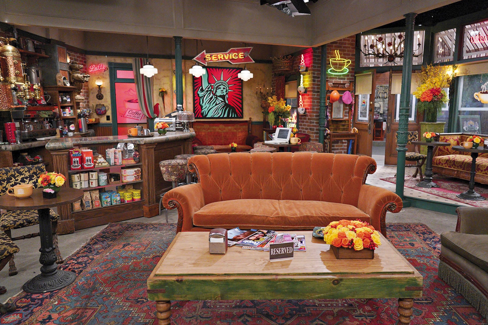
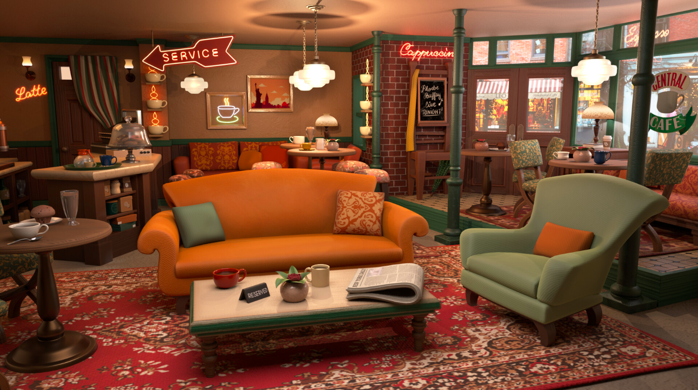

# Reconstruction de "Central perk" en réalité virtuelle avec A-Frame

Ce projet est effectué dans le cadre du cours Réalité virtuelle et augmentée donné par Isaac Pante à l'Université de Lausanne au semestre de Printemps 2022. 

Le but de ce projet était de reconstruire en réalité virtuelle "Central Perk", le fameux café de la série "Friends". 

À cette fin, j'ai utilisé des modèles gltf (open source ou créés / modifiés à l'aide de Blender) pour en composer une scène en réalité virtuelle avec A-Frame. 

## Inspiration

Pour imaginer la scène en réalité virtuelle, je me suis inspirée aussi bien des plans du café de la série, que d'autres modèles de "Central Perk" en 3D que j'ai trouvés sur Internet. 

## Modèles gltf

La première étape consistait à trouver des modèles gltf représentant les meubles et les objets de décor du café (pour cela j'ai utilisé sketchfab.com). 

Le nombre des modèles gltf open source est bien restreint, donc c'était souvent impossible de trouver un modèl identique au prototype réel. 

C'est là où d'autres modèles en 3D de "Central Perk" m'étaient utiles. Beaucoup d'eux sont composés des objets qui, si pris séparément, sont bien distincts de leurs prototypes. Mais placés ensemble, ils parviennent à recréer le "look&feel général" de la scène originelle. 

## Blender

Comme c'était ma première expérience de l'utilisation de Blender, je ne pouvais pas créer des objets complexes, mais j'ai appris à compléter certaines taches de base sur Blender, plus précisément:
- faire des modifications des modèles gltf importés – changer de couleur (par exemple, les tables rondes, le portemanteau), choisir un élément du modèle pour l'utiliser isolement (les chaises colorées)
- travailler avec les textures et créer de simples objets constitués de plusieurs textures (par exemple, les murs avec du papier peint) 
- créer des modèles gltf à partir des images 2D (les tableaux)
- créer de simples modèles gltf (l'enseigne au néon représentant une tasse de café)

## A-Frame

La partie finale du projet consistait à organiser les modèles au sein d'une scène A-Frame. Cela comprenait notamment:
- importation des modèles gltf
- mise à l'échelle et positionnement des objets
- travail avec les textures (le mur de briques)
- travail avec la caméra et la lumière 
